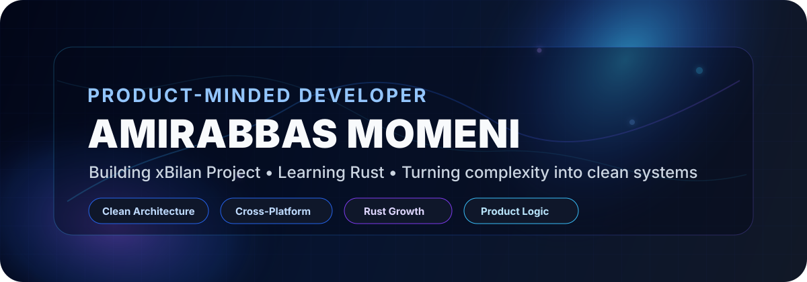
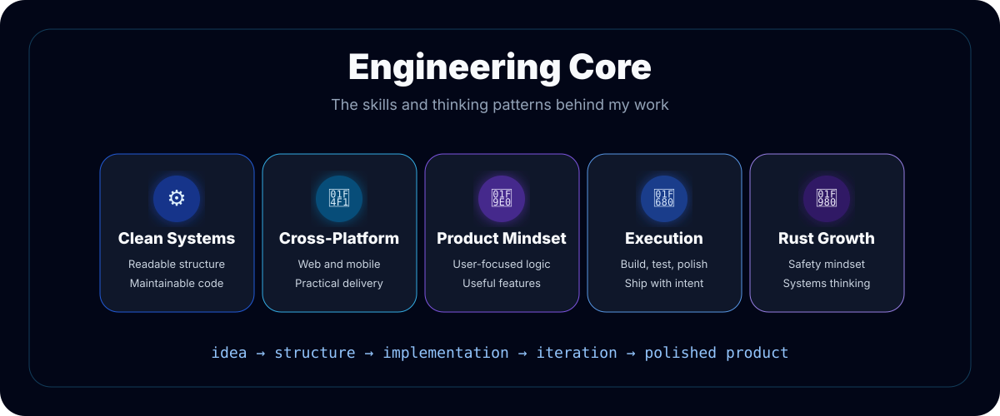
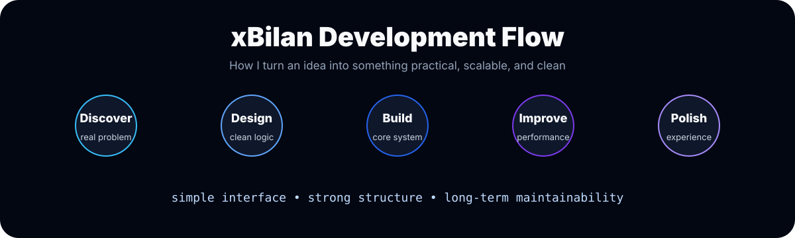
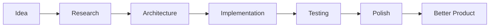
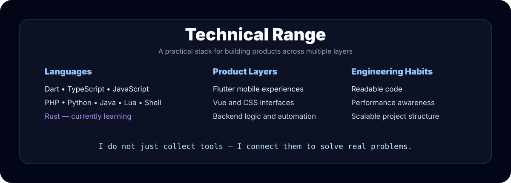

<div align="center">



<br/>

<a href="https://linkedin.com/in/amirabbas-momeni">
  
</a>
<a href="https://github.com/lilUnkelDemon">
  
</a>

<br/><br/>


</div>

---

# 👋 About Me

I’m **Amirabbas Momeni**, a product-minded developer focused on building software that is not only functional, but also **clean, scalable, understandable, and enjoyable to use**.

I like working at the intersection of **logic, design, architecture, and execution**.  
For me, good software is not just code that runs — it is a system that can grow, be maintained, and create real value.

```txt
Currently building : xBilan Project
Currently learning : Rust
Core mindset       : Build clean. Think deeply. Improve constantly.
Engineering style  : Practical, structured, performance-aware
```

---

## 🧠 My Developer Identity



I care about the full path from idea to implementation:

- understanding the real problem before writing code
- designing clean structures before adding complexity
- building features that are useful, not just impressive
- improving performance, maintainability, and developer experience
- learning technologies that make me a stronger engineer

---

## 🚀 What I’m Working On



### `xBilan Project`

I’m currently working on **xBilan Project**, where I focus on turning ideas into a practical product with a clean technical foundation.

My approach is simple:



I try to build every project with a mindset that balances:

| Area | What I Care About |
|---|---|
| Product | Clear purpose, useful features, smooth experience |
| Code | Readability, structure, maintainability |
| Performance | Fast behavior, optimized logic, less waste |
| Growth | Learning deeply instead of only using tools |
| Design | Clean interfaces and polished details |

---

## 🛠 Technical Range



### Languages & Tools

<div align="center">

<table>
<tr>
<td align="center"><b>Core Languages</b></td>
<td align="center"><b>Frontend & Mobile</b></td>
<td align="center"><b>Backend & Scripting</b></td>
<td align="center"><b>Currently Growing</b></td>
</tr>
<tr>
<td align="center">
Dart<br/>
TypeScript<br/>
JavaScript<br/>
Java<br/>
Lua
</td>
<td align="center">
Flutter<br/>
Vue.js<br/>
CSS3<br/>
Responsive UI<br/>
Component Thinking
</td>
<td align="center">
PHP<br/>
Python<br/>
Shell Script<br/>
Automation<br/>
Backend Logic
</td>
<td align="center">
Rust<br/>
Systems Thinking<br/>
Performance<br/>
Clean Architecture<br/>
Reliable Software
</td>
</tr>
</table>

</div>

---

## ⚡ Skill Stack

<div align="center">


</div>

---

## 🧩 How I Think About Software

```txt
A good developer writes code.
A strong developer designs systems.
A rare developer understands the product, the user, and the code at the same time.
```

My focus is to become the kind of engineer who can:

```txt
take a messy idea
break it into simple parts
design a clean structure
build the core system
polish the experience
and keep improving it
```

---

## 🧬 Personal Engineering Principles

| Principle | Meaning |
|---|---|
| **Clarity over chaos** | Code should be understandable before it becomes clever. |
| **Structure before speed** | Fast development without structure becomes technical debt. |
| **Product before ego** | The goal is not to show off, it is to solve the right problem. |
| **Details create quality** | Small improvements create a premium feeling. |
| **Learning never stops** | Every project should make me sharper than before. |

---

## 🦀 Why Rust?

I’m currently learning **Rust** because I want to build a stronger understanding of:

- memory safety
- performance
- systems programming
- reliable architecture
- low-level thinking
- writing code that fails less and scales better

Rust is not just another language in my stack — it is part of my long-term growth as an engineer.

---

## 📊 GitHub Analytics

> These cards use public GitHub README statistic services. If a public service is temporarily rate-limited, the main profile design still works because the core visuals are local assets inside this repository.

<div align="center">


<br/>


</div>

---

## 🏆 GitHub Trophies

<div align="center">


</div>

---

## 🌐 Connect

<div align="center">

<a href="https://linkedin.com/in/amirabbas-momeni">
  
</a>

<br/><br/>

```txt
Code with logic.
Build with purpose.
Improve with discipline.
```

</div>

---

<div align="center">

### ⚡ I do not just write code. I build systems that make ideas real.

</div>
